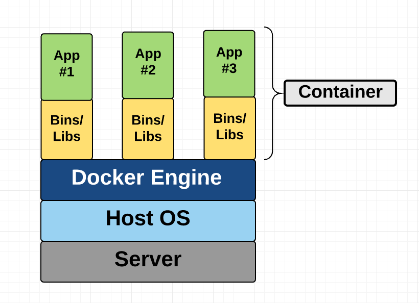

# Docker
[Docker](https://www.docker.com/) is one of the most popular container technology, which automates the deployment of applications by packaging an application with all of its dependencies into software containers.  Download the Docker engine [here](https://docs.docker.com/engine/installation/). The difference between docker containers and typical Virtual Machines (VMs): 

> The following section is from [A beginners' guide to Docker, Container and VMs](https://medium.freecodecamp.org/a-beginner-friendly-introduction-to-containers-vms-and-docker-79a9e3e119b) 

## What are containers and VMs?
Containers and VMs are similar in their goals: to isolate an application and its dependencies into a self-contained unit that can run anywhere.

Moreover, containers and VMs remove the need for physical hardware, allowing for more efficient use of computing resources, both in terms of energy consumption and cost-effectiveness.

The main difference between containers and VMs is in their architectural approach. Let’s take a closer look.

### Virtual Machines
A VM is essentially an emulation of a real computer that executes programs like a real computer. VMs run on top of a physical machine using a 'hypervisor'. A hypervisor, in turn, runs on either a host machine or on 'bare-metal'.

Let’s unpack the jargon:

A hypervisor is a piece of software, firmware, or hardware that run Virtual Machines. The hypervisors themselves run on physical computers, referred to as the “host machine”. The host machine provides the VMs with resources, including RAM and CPU. These resources are divided between VMs and can be distributed as you see fit. So if one VM is running a more resource heavy application, you might allocate more resources to that one than the other VMs running on the same host machine.

The VM that is running on the host machine (again, using a hypervisor) is also often called a “guest machine.” This guest machine contains both the application and whatever it needs to run that application (e.g. system binaries and libraries). It also carries an entire virtualized hardware stack of its own, including virtualized network adapters, storage, and CPU — which means it also has its own full-fledged guest operating system. From the inside, the guest machine behaves as its own unit with its own dedicated resources. From the outside, we know that it’s a VM — sharing resources provided by the host machine.

As mentioned above, a guest machine can run on either a hosted hypervisor or a bare-metal hypervisor. There are some important differences between them.

First off, a hosted virtualization hypervisor runs on the operating system of the host machine. For example, a computer running OSX can have a VM (e.g. VirtualBox or VMware Workstation 8) installed on top of that OS. The VM doesn’t have direct access to hardware, so it has to go through the host operating system (in our case, the Mac’s OSX).

The benefit of a hosted hypervisor is that the underlying hardware is less important. The host’s operating system is responsible for the hardware drivers instead of the hypervisor itself, and is therefore considered to have more "hardware compatibility". On the other hand, this additional layer in between the hardware and the hypervisor creates more resource overhead, which lowers the performance of the VM.

A bare-metal hypervisor environment tackles the performance issue by installing on and running from the host machine’s hardware. Because it interfaces directly with the underlying hardware, it doesn’t need a host operating system to run on. In this case, the first thing installed on a host machine’s server as the operating system will be the hypervisor. Unlike the hosted hypervisor, a bare-metal hypervisor has its own device drivers and interacts with each component directly for any I/O, processing, or OS-specific tasks. This results in better performance, scalability, and stability. The tradeoff here is that hardware compatibility is limited because the hypervisor can only have so many device drivers built into it.

After all this talk about hypervisors, you might be wondering why we need this additional "hypervisor" layer in between the VM and the host machine at all.

Well, since the VM has a virtual operating system of its own, the hypervisor plays an essential role in providing the VMs with a platform to manage and execute this guest operating system. It allows for host computers to share their resources amongst the virtual machines that are running as guests on top of them.

### Container
Unlike a VM which provides hardware virtualization, a container provides operating-system-level virtualization by abstracting the “user space”. You’ll see what I mean as we unpack the term container.

For all intent and purposes, containers look like a VM. For example, they have private space for processing, can execute commands as root (maybe), have a private network interface and IP address, allow custom routes and iptable rules, can mount file systems, and etc.

The one big difference between containers and VMs is that containers *share* the host system’s kernel with other containers.

This diagram shows you that containers package up just the user space, and not the kernel or virtual hardware like a VM does. Each container gets its own isolated user space to allow multiple containers to run on a single host machine. We can see that all the operating system level architecture is being shared across containers. The only parts that are created from scratch are the bins and libs. This is what makes containers so lightweight.

#### Where does Docker come in?
Docker is an open-source project based on Linux containers. It uses Linux Kernel features like namespaces and control groups to create containers on top of an operating system.

Containers are far from new; Google has been using their own container technology for years. Others Linux container technologies include Solaris Zones, BSD jails, and LXC, which have been around for many years.

So why is Docker all of a sudden gaining steam?

1. *Ease of use*: Docker has made it much easier for anyone — developers, systems admins, architects and others — to take advantage of containers in order to quickly build and test portable applications. It allows anyone to package an application on their laptop, which in turn can run unmodified on any public cloud, private cloud, or even bare metal. The mantra is: “build once, run anywhere.”

2. *Speed*: Docker containers are very lightweight and fast. Since containers are just sandboxed environments running on the kernel, they take up fewer resources. You can create and run a Docker container in seconds, compared to VMs which might take longer because they have to boot up a full virtual operating system every time.

3. *Docker Hub*: Docker users also benefit from the increasingly rich ecosystem of Docker Hub, which you can think of as an “app store for Docker images.” Docker Hub has tens of thousands of public images created by the community that are readily available for use. It’s incredibly easy to search for images that meet your needs, ready to pull down and use with little-to-no modification.

4. *Modularity and Scalability*: Docker makes it easy to break out your application’s functionality into individual containers. For example, you might have your Postgres database running in one container and your Redis server in another while your Node.js app is in another. With Docker, it’s become easier to link these containers together to create your application, making it easy to scale or update components independently in the future.

# Docker learning materials

[A beginners' guide to Docker, Container and VMs](https://medium.freecodecamp.org/a-beginner-friendly-introduction-to-containers-vms-and-docker-79a9e3e119b)

[Docker getting started](https://docs.docker.com/get-started/)

[An introduction to docker](http://prakhar.me/docker-curriculum/).

[Docker self-paced training](https://training.docker.com/)

[Docker quick reference sheet](docker-quick-ref.pdf)
