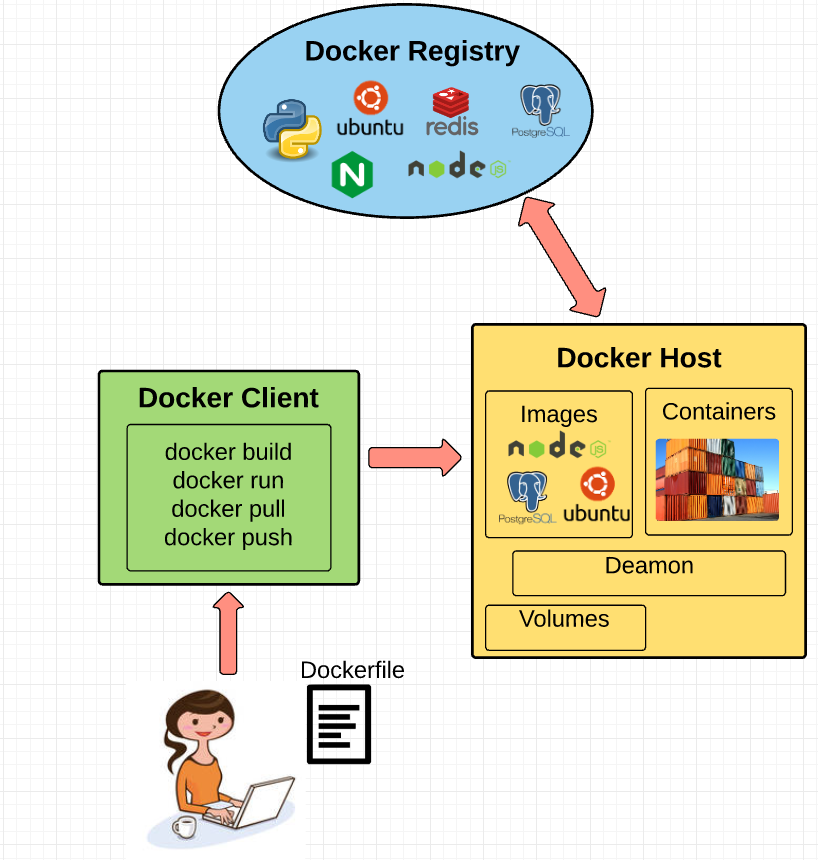

# Fundamental Docker Concepts
Now that we’ve got the big picture in place, let’s go through the fundamental parts of Docker piece by piece:

## Docker Engine
Docker engine is the layer on which Docker runs. It’s a lightweight runtime and tooling that manages containers, images, builds, and more. It runs natively on Linux systems and is made up of:

1. A Docker Daemon that runs in the host computer.
2. A Docker Client that then communicates with the Docker Daemon to execute commands.
3. A REST API for interacting with the Docker Daemon remotely.

## Docker Client
The Docker Client is what you, as the end-user of Docker, communicate with. Think of it as the UI for Docker. For example, when you do `docker build .` you are communicating to the Docker Client, which then communicates your instructions to the Docker Daemon.

## Docker Daemon
The Docker daemon is what actually executes commands sent to the Docker Client — like building, running, and distributing your containers. The Docker Daemon runs on the host machine, but as a user, you never communicate directly with the Daemon. The Docker Client can run on the host machine as well, but it’s not required to. It can run on a different machine and communicate with the Docker Daemon that’s running on the host machine.

## Images and containers
A container is launched by running an image. An *image* is an executable package that includes everything needed to run an application--the code, a runtime, libraries, environment variables, and configuration files.

A *container* is a runtime instance of an image--what the image becomes in memory when executed (that is, an image with state, or a user process). You can see a list of your running containers with the command, docker ps, just as you would in Linux.

Docker containers are built off Docker images. Since images are read-only, Docker adds a read-write file system over the read-only file system of the image to create a container.

